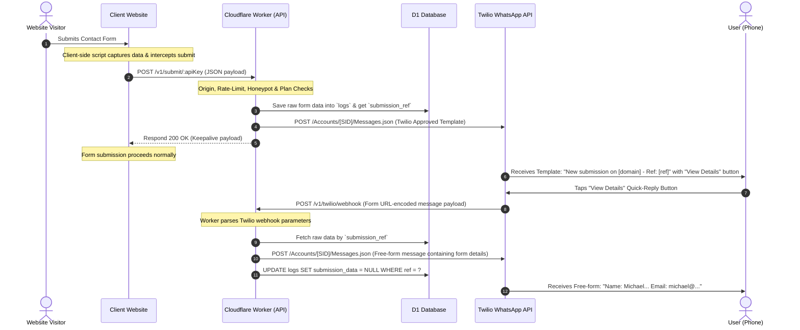

# FormBeep: System Architecture & Implementation Blueprint (Twilio Edition)
**Author**: Senior Principal Engineer, San Francisco  
**Date**: June 15, 2026  
**Status**: APPROVED FOR MANIFESTATION (Decisions Locked)

---

## Executive Summary & Design Philosophy

FormBeep is a highly optimized, serverless micro-SaaS designed to deliver website contact form submissions directly to WhatsApp notifications. 

Based on the architectural review and design decisions, this blueprint is tailored for a **Cloudflare serverless edge stack** utilizing **Twilio's Programmable Messaging API** for WhatsApp delivery and **Clerk** for user dashboard authentication.

### Locked Stack & Vendor Decisions
1. **API Gateway & Routing**: [Hono](https://hono.dev/) running on **Cloudflare Workers**.
2. **Database**: **Cloudflare D1** (distributed SQLite at the edge) for strong read-after-write consistency.
3. **Caching & Rate-Limiting**: **Cloudflare KV** (eventually consistent key-value store).
4. **Authentication**: **Clerk** (JWT verification using RS256 + JWKS at the edge).
5. **Dashboard UI**: Plain HTML/CSS/JS hosted on **Cloudflare Pages** (no build steps, vanilla JS for instant loading).
6. **Messaging Gateway**: **Twilio WhatsApp API** (utilizing Twilio WhatsApp Templates and Programmable SMS API).
7. **Payments**: **Stripe** (via webhooks).

---

## 1. User & Notification Flow (Twilio Pattern)

To bypass Meta’s strict 24-hour customer service window (which is enforced on Twilio as well), we utilize a two-message pattern. 

### The Twilio Two-Message Sequence



1. **Step 1: Outbound Template Dispatch**: When a form is submitted on a user's site, the Worker saves the details to D1 and dispatches an outbound WhatsApp template message through Twilio.
   - *Message Content*: `"New form submission on [domain]. Ref: {{1}}. Tap below to view details."` (where `{{1}}` is a unique `submission_ref` code).
   - *Button*: A Quick Reply button configured in the Twilio console.
2. **Step 2: Button Interaction**: When the user taps the Quick Reply button on WhatsApp, Twilio receives the tap event and triggers our Webhook endpoint (`POST /v1/twilio/webhook`).
3. **Step 3: Webhook Verification**: Twilio sends the webhook as `application/x-www-form-urlencoded`. The Worker extracts:
   - `From`: The user's WhatsApp number (e.g. `whatsapp:+123456789`).
   - `Body`: The text body of the incoming message (which contains the reference or button text).
4. **Step 4: Payload Retrieval & Purging**: The Worker fetches the matching row from D1 using the reference code. It formats the fields into a plain text message, dispatches it to Twilio as a free-form message, and immediately updates the database row, nulling `submission_data` for privacy compliance.

---

## 2. Database Schema (Cloudflare D1 SQLite)

```sql
-- 1. User accounts and configuration
CREATE TABLE users (
  user_id TEXT PRIMARY KEY,               -- Clerk user identifier (e.g., user_...)
  api_key TEXT UNIQUE NOT NULL,           -- Prefix-based API key (e.g., fbp_...)
  plan TEXT DEFAULT 'free',               -- 'free', 'starter', 'pro', 'business', 'agency'
  whatsapp_numbers TEXT DEFAULT '[]',     -- JSON array of verified numbers: ["+15550100", ...]
  allowed_domains TEXT DEFAULT '[]',      -- JSON array of allowed origins: ["example.com", "localhost"]
  stripe_customer_id TEXT,                -- Stripe customer reference
  subscription_status TEXT,               -- Stripe subscription state (active, trialing, past_due)
  subscription_expires_at INTEGER,        -- Unix timestamp in ms
  created_at INTEGER NOT NULL             -- Unix timestamp in ms
);
CREATE INDEX idx_users_api_key ON users(api_key);

-- 2. Message counters (atomic usage trackers for billing cycles)
CREATE TABLE message_counts (
  user_id TEXT NOT NULL,
  period_key TEXT NOT NULL,               -- Format: "YYYY-MM" (billing period key)
  count INTEGER DEFAULT 0,
  PRIMARY KEY (user_id, period_key)
);

-- 3. Submission logs (For dashboard reporting and WhatsApp data retrieval)
CREATE TABLE logs (
  id INTEGER PRIMARY KEY AUTOINCREMENT,
  user_id TEXT NOT NULL,
  domain TEXT NOT NULL,
  field_names TEXT,                       -- JSON array of keys submitted (e.g., '["Name", "Email"]')
  recipients_count INTEGER,               -- Number of WhatsApp accounts this was sent to
  delivery_status TEXT DEFAULT 'pending', -- 'pending', 'sent', 'failed'
  submission_ref TEXT UNIQUE,             -- High-entropy short identifier for WhatsApp callback link
  submission_data TEXT,                   -- JSON object string (sensitive values; nulled after viewing)
  viewed_count INTEGER DEFAULT 0,         -- Tracking button clicks
  created_at INTEGER NOT NULL,            -- Unix timestamp in ms
  FOREIGN KEY (user_id) REFERENCES users(user_id)
);
CREATE INDEX idx_logs_user_id ON logs(user_id);
CREATE INDEX idx_logs_submission_ref ON logs(submission_ref);
```

---

## 3. Client-Side Script Blueprint (`formbeep.js`)

This script runs globally on client websites. It captures submissions from all forms on the page, filters out forms or fields decorated with `data-formbeep-ignore`, and dispatches the payload to the Worker.

```javascript
(function() {
  "use strict";
  const VERSION = "1.3.0";
  const API_ENDPOINT = "https://api.formbeep.com/v1/submit/";
  
  const currentScript = document.currentScript;
  if (!currentScript) return;
  const apiKey = currentScript.getAttribute("data-api-key");
  if (!apiKey) return;

  function injectHoneypots(form) {
    if (form._fbHoneypots) return;
    form._fbHoneypots = {};
    
    ["formbeep_hp", "w2p_hp"].forEach(name => {
      const input = document.createElement("input");
      input.type = "text";
      input.value = "";
      input.autocomplete = "off";
      input.tabIndex = -1;
      input.setAttribute("aria-hidden", "true");
      input.style.cssText = "position:absolute;left:-9999px;width:1px;height:1px;opacity:0;pointer-events:none;";
      
      if (form.parentNode) {
        form.parentNode.insertBefore(input, form);
        form._fbHoneypots[name] = input;
      }
    });
  }

  function resolveFieldLabel(field) {
    if (field.id) {
      const explicitLabel = document.querySelector(`label[for="${field.id}"]`);
      if (explicitLabel && explicitLabel.textContent) {
        return explicitLabel.textContent.trim().replace(/\s*:?\s*\*?\s*$/, "");
      }
    }

    let parent = field.parentElement;
    while (parent) {
      if (parent.tagName === "LABEL") {
        let labelText = "";
        for (let i = 0; i < parent.childNodes.length; i++) {
          const node = parent.childNodes[i];
          if (node.nodeType === 3 || (node.nodeType === 1 && node !== field && !/INPUT|SELECT|TEXTAREA/.test(node.tagName))) {
            labelText += node.textContent;
          }
        }
        labelText = labelText.trim().replace(/\s*:?\s*\*?\s*$/, "");
        if (labelText) return labelText;
      }
      parent = parent.parentElement;
    }

    if (field.name) {
      const sibling = field.previousElementSibling;
      if (sibling && /label|field-label|form-label/i.test(sibling.className)) {
        const text = sibling.textContent.trim().replace(/\s*:?\s*\*?\s*$/, "");
        if (text) return text;
      }
    }

    if (field.getAttribute("aria-label")) {
      return field.getAttribute("aria-label").trim();
    }
    if (field.placeholder && field.placeholder.trim()) {
      return field.placeholder.trim();
    }

    return field.name;
  }

  function serializeForm(form) {
    const data = {};
    const elements = form.elements;

    for (let i = 0; i < elements.length; i++) {
      const field = elements[i];
      if (!field.name || field.disabled || field.hasAttribute("data-formbeep-ignore")) continue;
      if (/submit|button|reset|image|hidden/i.test(field.type)) continue;

      const label = resolveFieldLabel(field);

      if (field.type === "file") {
        if (field.files && field.files.length > 0) {
          const fileNames = [];
          for (let j = 0; j < field.files.length; j++) {
            fileNames.push(field.files[j].name);
          }
          data[label] = fileNames.join(", ");
        }
        continue;
      }

      if ((field.type === "checkbox" || field.type === "radio") && !field.checked) {
        continue;
      }

      if (field.type === "select-multiple") {
        const selected = [];
        for (let j = 0; j < field.options.length; j++) {
          if (field.options[j].selected) selected.push(field.options[j].value);
        }
        if (selected.length) data[label] = selected.join(", ");
        continue;
      }

      data[label] = field.value;
    }
    return data;
  }

  function enhanceForm(form) {
    if (form._fbEnhanced || form.hasAttribute("data-formbeep-ignore")) return;
    form._fbEnhanced = true;
    
    injectHoneypots(form);
    
    form.addEventListener("submit", function() {
      const payload = serializeForm(form);
      
      if (form._fbHoneypots) {
        Object.keys(form._fbHoneypots).forEach(name => {
          payload[name] = form._fbHoneypots[name].value;
        });
      }

      fetch(API_ENDPOINT + apiKey, {
        method: "POST",
        headers: { "Content-Type": "application/json" },
        body: JSON.stringify(payload),
        keepalive: true
      }).catch(err => {
        console.error("[FormBeep] Background dispatch error:", err);
      });
    }, false);
  }

  function init() {
    const forms = document.querySelectorAll("form");
    forms.forEach(enhanceForm);

    if (window.MutationObserver) {
      const observer = new MutationObserver(mutations => {
        mutations.forEach(mutation => {
          mutation.addedNodes.forEach(node => {
            if (node.nodeType === 1) {
              if (node.tagName === "FORM") {
                enhanceForm(node);
              } else if (node.querySelectorAll) {
                node.querySelectorAll("form").forEach(enhanceForm);
              }
            }
          });
        });
      });
      observer.observe(document.body, { childList: true, subtree: true });
    }
  }

  if (document.readyState === "loading") {
    document.addEventListener("DOMContentLoaded", init);
  } else {
    init();
  }
})();
```

---

## 4. API Endpoint Handlers (Hono + Twilio integration)

### A. Form Ingestion Handler (`POST /v1/submit/:apiKey`)

```javascript
app.post('/v1/submit/:apiKey', async (c) => {
  const apiKey = c.req.param('apiKey');
  const payload = await c.req.json();
  const origin = c.req.header('Origin') || c.req.header('Referer');
  
  function extractHostname(urlStr) {
    try { return new URL(urlStr).hostname; } catch { return null; }
  }
  const domain = extractHostname(origin);

  // 1. Fetch User Configuration
  const user = await c.env.FORMBEEP_DB.prepare(
    "SELECT * FROM users WHERE api_key = ?"
  ).bind(apiKey).first();

  if (!user) return c.json({ error: "Invalid API Key" }, 401);

  // 2. Allowed Domains Check
  const allowed = JSON.parse(user.allowed_domains || "[]");
  if (!allowed.includes(domain)) return c.json({ error: "Domain not authorized" }, 403);

  // 3. Honeypot check
  if (payload.formbeep_hp || payload.w2p_hp) {
    return c.json({ status: "success", msg: "filtered" }, 200);
  }
  delete payload.formbeep_hp;
  delete payload.w2p_hp;

  // 4. Generate Reference & Save Data
  const submissionRef = generateUniqueRefCode(); // A 6-character short code, e.g. "F8X1Z9"
  const fieldNames = JSON.stringify(Object.keys(payload));

  await c.env.FORMBEEP_DB.prepare(
    `INSERT INTO logs (user_id, domain, field_names, submission_ref, submission_data, created_at)
     VALUES (?, ?, ?, ?, ?, ?)`
  ).bind(
    user.user_id, 
    domain, 
    fieldNames, 
    submissionRef, 
    JSON.stringify(payload), 
    Date.now()
  ).run();

  // 5. Dispatch Twilio WhatsApp Template
  const recipients = JSON.parse(user.whatsapp_numbers || "[]");
  for (const number of recipients) {
    await sendTwilioTemplate(c.env, number, domain, submissionRef);
  }

  // 6. Update Message Counter
  const periodKey = new Date().toISOString().slice(0, 7);
  await c.env.FORMBEEP_DB.prepare(
    `INSERT INTO message_counts (user_id, period_key, count)
     VALUES (?, ?, 1)
     ON CONFLICT(user_id, period_key)
     DO UPDATE SET count = count + 1`
  ).bind(user.user_id, periodKey).run();

  return c.json({ status: "success" }, 200);
});

// Twilio Client Handoff
async function sendTwilioTemplate(env, number, domain, ref) {
  const accountSid = env.TWILIO_ACCOUNT_SID;
  const authToken = env.TWILIO_AUTH_TOKEN;
  const twilioNumber = env.TWILIO_WHATSAPP_NUMBER; // e.g. "whatsapp:+14155552671"
  
  // Dispatch request to Twilio API
  await fetch(`https://api.twilio.com/2010-04-01/Accounts/${accountSid}/Messages.json`, {
    method: 'POST',
    headers: {
      'Authorization': 'Basic ' + btoa(`${accountSid}:${authToken}`),
      'Content-Type': 'application/x-www-form-urlencoded'
    },
    body: new URLSearchParams({
      From: twilioNumber,
      To: `whatsapp:${number}`,
      // Twilio templates must be registered in the console and contain parameters
      Body: `New form submission on ${domain}. Ref: ${ref}. Tap below to view details.`,
      // If using quick-reply buttons, Twilio allows registering them as part of the template.
    })
  });
}
```

### B. Twilio Webhook Receiver (`POST /v1/twilio/webhook`)
Processes Twilio's incoming webhook payload when a user replies to the template message or taps the Quick Reply button.

```javascript
app.post('/v1/twilio/webhook', async (c) => {
  // Twilio sends application/x-www-form-urlencoded
  const body = await c.req.parseBody();
  const senderNumber = body.From; // format "whatsapp:+15550100"
  const incomingMessageText = body.Body.trim(); // The body of the message (containing the reference code)

  // 1. Clean number
  const formattedSender = senderNumber.replace("whatsapp:", "");

  // 2. Resolve the submission reference from the incoming text
  // We can look up the ref from the incoming text. If user typed/selected "F8X1Z9" or "View Details F8X1Z9"
  const refMatch = incomingMessageText.match(/[A-Z0-9]{6}/i); 
  if (!refMatch) return c.text("Reference not detected in body", 200);
  const refCode = refMatch[0].toUpperCase();

  // 3. Fetch submission details
  const log = await c.env.FORMBEEP_DB.prepare(
    "SELECT * FROM logs WHERE submission_ref = ?"
  ).bind(refCode).first();

  if (log && log.submission_data) {
    const data = JSON.parse(log.submission_data);
    
    // 4. Format Submission Details
    let detailsText = `*Submission details for ${log.domain}*\n\n`;
    for (const [key, val] of Object.entries(data)) {
      detailsText += `*${key}:* ${val}\n`;
    }

    // 5. Send Free-Form Response via Twilio
    await fetch(`https://api.twilio.com/2010-04-01/Accounts/${c.env.TWILIO_ACCOUNT_SID}/Messages.json`, {
      method: 'POST',
      headers: {
        'Authorization': 'Basic ' + btoa(`${c.env.TWILIO_ACCOUNT_SID}:${c.env.TWILIO_AUTH_TOKEN}`),
        'Content-Type': 'application/x-www-form-urlencoded'
      },
      body: new URLSearchParams({
        From: c.env.TWILIO_WHATSAPP_NUMBER,
        To: senderNumber,
        Body: detailsText
      })
    });

    // 6. Permanently Purge values (View & Delete model)
    await c.env.FORMBEEP_DB.prepare(
      "UPDATE logs SET submission_data = NULL, viewed_count = viewed_count + 1 WHERE submission_ref = ?"
    ).bind(refCode).run();
  }

  // Twilio expects TwiML in response (empty response is fine for messaging)
  return c.text("<Response></Response>", 200, { "Content-Type": "text/xml" });
});
```

---

## 5. Third-Party Webhook Router (`POST /v1/webhook/:webhookId`)
Allows integration of Webflow, Jotform, Tally, or server-to-server dispatch routes.

```javascript
app.post('/v1/webhook/:webhookId', async (c) => {
  const webhookId = c.req.param('webhookId');
  const rawPayload = await c.req.json();

  // 1. Resolve User config using a lookup map (or querying webhook registry table in D1)
  // Let's assume a registry links webhookId -> user_id & allowed settings.
  const webhookRegistry = await c.env.FORMBEEP_DB.prepare(
    "SELECT * FROM webhooks WHERE id = ?"
  ).bind(webhookId).first();
  
  if (!webhookRegistry) return c.json({ error: "Invalid webhook ID" }, 404);

  const user = await c.env.FORMBEEP_DB.prepare(
    "SELECT * FROM users WHERE user_id = ?"
  ).bind(webhookRegistry.user_id).first();

  // 2. Flatten JSON utility
  function flattenJson(obj) {
    let result = {};
    for (const [key, value] of Object.entries(obj)) {
      if (typeof value === 'object' && value !== null && !Array.isArray(value)) {
        Object.assign(result, flattenJson(value));
      } else if (Array.isArray(value)) {
        result[key] = value.join(", ");
      } else {
        result[key] = String(value);
      }
    }
    return result;
  }

  // Remove common metadata noise
  const ignoreKeys = ['event', 'eventId', 'createdAt', 'webhookId', 'timestamp', 'secret'];
  const cleanedPayload = flattenJson(rawPayload);
  ignoreKeys.forEach(k => delete cleanedPayload[k]);

  // 3. Generate Ref, Save to D1 & Dispatch Twilio message (matches /v1/submit flow)
  const refCode = generateUniqueRefCode();
  await c.env.FORMBEEP_DB.prepare(
    `INSERT INTO logs (user_id, domain, field_names, submission_ref, submission_data, created_at)
     VALUES (?, ?, ?, ?, ?, ?)`
  ).bind(
    user.user_id, 
    webhookRegistry.name, // e.g. "Webflow Integration"
    JSON.stringify(Object.keys(cleanedPayload)), 
    refCode, 
    JSON.stringify(cleanedPayload), 
    Date.now()
  ).run();

  const recipients = JSON.parse(webhookRegistry.whatsapp_numbers || user.whatsapp_numbers);
  for (const number of recipients) {
    await sendTwilioTemplate(c.env, number, webhookRegistry.name, refCode);
  }

  return c.json({ status: "success" }, 200);
});
```

---

## 6. Verification & Implementation Plan

```markdown
- [ ] Phase 1: Twilio Setup & Template Registration
    - [ ] Create Twilio Account & Enable WhatsApp Sandbox/Production
    - [ ] Submit WhatsApp Template message in Twilio Console:
        - Copy: "New form submission on {{1}}. Ref: {{2}}. Tap below to view details."
        - Configure a Quick Reply button returning text payload: "Get Details {{2}}"
- [ ] Phase 2: Client-Side Script
    - [ ] Test `formbeep.js` locally to ensure it binds to HTML forms without blocking standard actions
- [ ] Phase 3: Cloudflare Worker Dev
    - [ ] Configure `wrangler.toml` with D1 binding and environment variables (`TWILIO_ACCOUNT_SID`, `TWILIO_AUTH_TOKEN`, `TWILIO_WHATSAPP_NUMBER`)
    - [ ] Implement Hono endpoints:
        - `POST /v1/submit/:apiKey`
        - `POST /v1/twilio/webhook` (URL-encoded parser)
        - `POST /v1/webhook/:webhookId`
- [ ] Phase 4: UI Dashboard Pages
    - [ ] Build index.html, domains.html, webhooks.html, and logs.html using Clerk JS tags for auth
- [ ] Phase 5: Verification & Testing
    - [ ] Validate rate limits, Honeypot functionality, and instant DB view-and-delete cleanup
```
